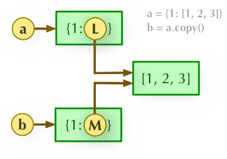
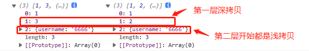
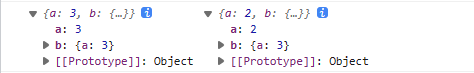
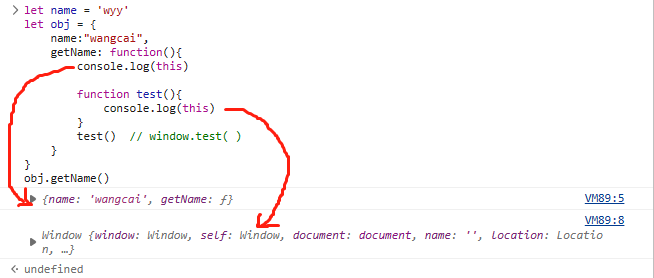

# JS 面试题

## 1. 直接赋值 (引用)、浅拷贝、深拷贝

### 区别

- **直接赋值 (引用)：**其实就是对象的引用（别名）
- **浅拷贝：**拷贝父对象，不会拷贝对象的内部的子对象
- **深拷贝：**完全拷贝了父对象及其子对象


1. **b = a:** 赋值引用，a 和 b 都指向同一个对象

	

2. **b = a.copy():** 浅拷贝, a 和 b 是一个独立的对象，但他们的子对象还是指向统一对象（是引用）

	

3. **b = copy.deepcopy(a):** 深度拷贝, a 和 b 完全拷贝了父对象及其子对象，两者是完全独立的

	


### 实现

**浅拷贝**

对象：Object.assign()

```javascript
var obj = {a:{a:"kobe",b:39}}
var initalObj = Object.assign({},obj)
initalObj.a.a = "wade"
console.log(obj.a.a) //wade
```

> object 只有一层的时候，是深拷贝


这个 API 还可用于 对象合并

```javascript
const ul = {name:"zhangsan"}
const u2 = {age: 12}

const u3 = Object.assign(ul，u2);

console.log(u3) // { name:'zhangsan'，age: 12 }
```


数组：concat、slice

```javascript
let arr1 = [ 1, 3, {
    username:'kobe'
}]

let arr2 = arr1.slice() // 或者 let arr2 = arr.concat()

arr2[1] = 2
arr2[2].username = '6666'
console.log(arr1, arr2)
```

	


> Array 的 slice 和 concat 方法不修改原数组，只会返回一个浅复制了原数组中的元素的一个新数组


`扩展运算符`，也可以进行 `浅拷贝`

```javascript
let a = { a:2, b:{a:2} }
let b = {...a}

b.b.a = 3
a.a = 3
console.log(a, b)
```

	


**深拷贝**

1. 序列化 JSON.parse(JSON.stringify())

> 缺点：虽然可以实现数组或对象深拷贝，但不能处理函数

2. 递归遍历

手写实现

```javascript
// 定义检测数据类型的功能函数
function checkedType(target){
    return Object.prototype.toString.call(target).slice(8,-1)
}

// 实现深度克隆---对象/数组
function clone(target){
    // 判断拷贝的数据类型
    // 初始化变量result 成为最终克隆的数据
    let result,targetType = checkedType(target)
    if(targetType === 'Object'){
        result = {}
    }else if(targetType === 'Array'){
        result = []
    }else{
        return target
    }
    // 遍历目标数据
    for(let i in target){
        // 获取遍历数据结构的每一项值
        let value=target[i]
        // 判断目标结构里的每一值是否存在对象/数组
        if(checkedType(value) === 'Object' || checkedType(value) === 'Array'){ //对象/数组里嵌套了对象/数组
            // 继续遍历获取到value值
            result[i] = clone(value)
        }else{ //获取到value值是基本的数据类型或者是函数
            result[i] = value;
        }
    }
    return result
}
```


> 原理：递归遍历所有对象、数组，直到都是基本数据类型，然后再去复制，就是深拷贝

3. 第三方函数库 `loadsh`


## 2. ES6 新特性

### 箭头函数函数 与 普通函数的区别？

- this 指向不同, 且箭头函数 this 无法改变 (因为 箭头函数本身就没有原型，所以也没有所谓的 this)
- 写法不同, 且箭头函数都是匿名函数
- 箭头函数、没有 `prototype`、没有自己的 `this` 指向、不可以使用 `arguments`、自然不可以 `new`
- 普通函数的 this ，谁调用了这个函数，this 就指向谁

```javascript
let name = 'wyy'
let obj = {
    name:"wangcai",
    getName: function(){
        console.log(this)              

        function test(){
            console.log(this)                   
        }
        test()  // window.test( )
    }
}
obj.getName()
```

	


### var 和 let、const

- 变量提升
- 块级作用域
- 暂时性死区
- 重复声明


### Promise

#### Promise 状态

Promise 有三种状态：pengding、fulfilled、rejected

Promise 的状态一经改变，便可以修改

```javascript
var pro = new Promise( (resolve, reject) => {
    reject()
    resolve()
})

pro.then( () => { console.log('resolve1') }).
	catch( () => {console.log('catch1') }) // reject1
```


#### Promise 链式调用

Promise 的链式调用，有三个 `Promise.prototype.then()`、`Promise.prototype.catch()` 和 `Promise.prototype.finally()`


> `Promise.prototype.then()` then 方法可以接收两个回调函数作为参数，第一个参数 `resolve()` 返回的数据，第二个参数 `reject()` 返回的数据
>
> 当然了，异常也会被第二个参数接收


`.finally()` 一定会执行，但是它没有回调参数

`.then()` 可有多个，`.catch()` 也可以有多个，但是 `.then()` 或者 `.catch()` 必须返回一个 Promise 才可以这样做


数据的接收顺序

- then -> catch -> finally

```javascript
var pro = new Promise( (resolve, reject) => {
    reject()
    resolve()
})

pro.then(
    () => { console.log('resolve1') },
    () => { console.log('reject1') }).
	catch( () => {console.log('catch1') }
) // reject1
```


> 只有 `.then()` 的第二个参数传，`reject()` 返回的数据 或者是 异常才会进到 `.catch()` 中
>
> **[注意]** Promise 抛出异常是不会，直接中断的，会进入 `.then()` 的第二个参数，没有 `.then()` 的第二个参数才会 进入 `.catch()` 中


#### Promise 的一些 API

- Promise.all() 一个 `reject()`, 整个结束执行 (获取全部都成功，再返回)
- Promise.allSettled() 全部状态变更，才执行结束
- Promise.any() 一个 `resolve()`，整个再返回 (获取全部都失败，再返回)
- Promise.race() 那个状态先改变，那个先返回


> await 后面跟着一个表达式，获取表达式的返回值
>
> [理解 JavaScript 的 async/await](https://www.nowcoder.com/discuss/353148496452722688?sourceSSR=users)


## 3. 事件循环


