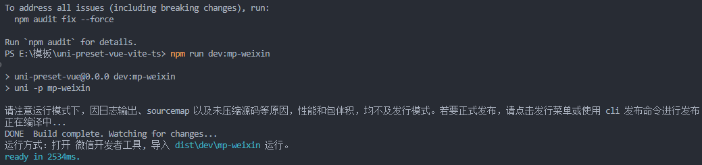

# 从零搭建小程序模板，你也是架构师

## uni-app 命令行安装

1. 环境安装

```shell
npm install -g @vue/cli
```

2. 下载 `uni-app` [Vue3/Vite](https://gitee.com/dcloud/uni-preset-vue/repository/archive/vite-ts.zip) 版
3. 安装依赖

```shell
npm install
```

4. 启动项目，这里以微信小程序为例

```shell
npm run dev:mp-weixin
```

5. 运行结果

	


> 【注意】
>
> 运行命令，可以在 `package.json` 中查看


## 团队 提交规范

|                   功能                   | 依赖库 |
| :--------------------------------------: | ------ |
| 代码风格检查、检查代码中潜在的问题和错误 | ESlint |
|                                          |        |
|                                          |        |


### ESLint

eslint 是一个代码检测工具，用于检测代码中潜在的问题和错误，作用提高代码质量和规范


1. 安装 eslint

```shell
npm install eslint
```

2. 快速构建 eslint 配置文件

```shell
npm init @eslint/config
```

手动配置，手动创建 `.eslintrc.js` 文件，该文件用于识别需要检查哪些东西

```javascript
module.exports = {
  env: {
    browser: true,
    es2021: true
  },
  extends: [
    'eslint:recommended',
    'plugin:vue/vue3-essential',
    'plugin:@typescript-eslint/recommended',
    'plugin:prettier/recommended',
    './.eslintrc-auto-import.json'
  ],
  overrides: [],
  parser: 'vue-eslint-parser',
  parserOptions: {
    parser: '@typescript-eslint/parser',
    ecmaVersion: 2020
  },
  plugins: ['vue', '@typescript-eslint'],
  rules: {
    'linebreak-style': ['error', 'windows'],
    quotes: ['error', 'single'],
    semi: ['error', 'never'],
    'no-console': 'off',
    'no-debugger': 'off',
    'no-undef': 'off',
    '@typescript-eslint/no-explicit-any': 'off',
    '@typescript-eslint/no-use-before-define': 'off',
    '@typescript-eslint/no-inferrable-types': 'off',
    '@typescript-eslint/no-unused-vars': 'off',
    '@typescript-eslint/no-non-null-assertion': 'off',
    '@typescript-eslint/no-var-requires': 'off',
    '@typescript-eslint/no-namespace': 'off',
    'no-inner-declarations': 'off',
    '@typescript-eslint/no-this-alias': 'off',
    '@typescript-eslint/no-empty-function': 'off',
    'vue/multi-word-component-names': 'off'
  }
}
```

3. 创建 `.eslintignore` 文件，该文件用于告诉程序，那些文件需要忽略，不需要检查

```Ignore
babel.config.js
src/uni_modules/mp-html/*
src/uni_modules/fant-mini-plus/*
koa-mock
```


### husky

husky 是一个 Git 钩子工具，它可以让你在 Git 事件发生时执行脚本、进行代码格式化、测试操作等


常见的钩子

- `pre-commit` 在执行 Git `commit` 命令之前触发
- `commit-msg` 在提交消息 `commit message` 被创建后
- `pre-push` 在执行 Git `push` 命令之前触发


> 【注意】
>
> 需要在 `.git` 文件同目录下安装 husky，否则无法识别环境导致安装失败

1. husky 安装

```shell
npm install husky --save-dev
```

2. 初始化 git

```shell
git init
```

3. 创建 `.husky` 文件

```shell
npm run prepare
```


### 创建 Git 挂钩

**pre-commit**

在 Git 提交前做 `eslint` 语法校验


1. 创建钩子脚本文件 `pre-commit`

```shell
npx husky add .husky/pre-commit
```

2. 配置代码检查

git 提交前，执行 `pre-commit` 钩子脚本，进行校验代码语法、格式修复等操作

```javascript
#!/bin/sh
. "$(dirname "$0")/_/husky.sh"

npx lint-staged --allow-empty $1
```


**lint-staged**

- 作用：lint-staged 可以让你在 Git 暂存区域中的文件上运行脚本，通常在提交前对代码进行格式化、静态检查等操作


1. 安装 lint-staged

```shell
npm install lint-staged --save-dev
```

2. 在 `package.json` 文件中添加如下配置

```javascript
{
    "lint-staged": {
		// *.{js,ts,vue} 校验暂存区、指定目录下的文件类型
		// eslint --fix --ext 校验命令
       	"*.{js,ts,vue}": "eslint --fix --ext .js,.vue,.ts src"
     }
}
```


### prettier

`prettier` 是一个代码格式化工具，`prettier` 与上述 `husky` 和 `lint-staged` 搭配使用，可以在提交代码之前自动格式化代码


1. 安装 prettier

```shell
npm install prettier --save-dev
```

2. 创建 `.prettierrc.js` 文件，并定义你想要的代码样式

```javascript
{
  "printWidth": 150,
  "semi": false,
  "singleQuote": true,
  "trailingComma": "none",
  "bracketSpacing": true,
  "requirePragma": false,
  "proseWrap": "preserve",
  "arrowParens": "always",
  "htmlWhitespaceSensitivity": "ignore"
}
```


### commitlint + commitizen

- 作用：用于规范 commit message


