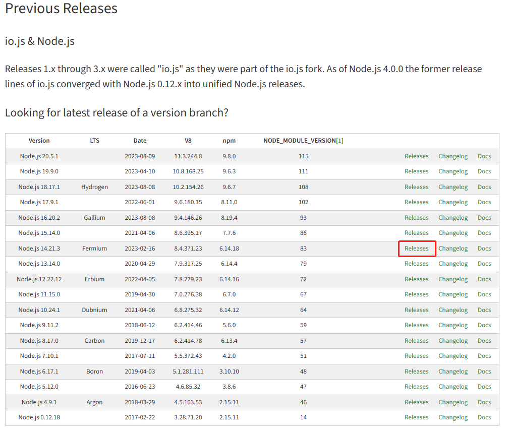

# npm-管理插件

## node 版本管理插件

nvm 相关命令

```shell
# 查看已经安装的版本
nvm list 

# 安装最新版本 nvm
nvm install 

# 切换使用指定的版本node
nvm use

# 下载版本号为14.16.1的node
nvm install 14.16.1 

# 卸载版本号为14.16.1的node
nvm uninstall 14.16.1

# 查看 帮助
nvm --help

# 获取所有可使用版本信息
nvm list available
```


**nvm 低版本 node 下载**

如果可使用版本列表没有，你需要的版本，可以去 [node低版本库](https://nodejs.org/en/download/releases) 下载

1. 比如下载 `v14` 版本的

	

2. 选择对应系统的文件下载，我的是 window

	

3. 查找 nvm 的 node 包存放目录

```shell
nvm root
# 运行结果：Current Root: C:\Users\Administrator\AppData\Roaming\nvm
```


4. 进入目录 `C:\Users\Administrator\AppData\Roaming\nvm`，将安装包进行解压，并修改名字为当前 node 对应版本命 `v14.21.3`

	

**[注意]**

版本包`v14.21.3` 里面是这样的

	


## 依赖包 管理工具 

ncu: npm-check-updates

```shell
# 安装
npm install -g npm-check-updates

# 检查更新
ncu

# 升级packjson.json
ncu -u

# 安装
npm isntall
```


## 安装指定版本插件

```shell
# 直接在插件名后面加版本号
npm add vue-i18n@8.14.1 -S

# 直接修改 package.json 中插件的版本号，在重新下载插件
npm install
```


## 单元测试插件

```shell
# 安装
npm install jest --save-dev

# 测试
npm test src/test.ts
```

```tsx
// 测试代码
import { flattern } from './array-flatten'

describe('数组扁平化', () => {
    it('空数组', () => {
        const res = flatten1(arr)
        expect(res).toEqual([1, 2, 3])
    })
})
```


## 简易服务器插件 (开发时使用)

```shell
# 安装
npm install --save-dev lite-server
```

```json
// package.json 中配置
"scripts": {
	"test": "echo \"Error: no test specified\" && exit 1",
	"start": "lite-server"
},
```

```shell
# 运行 服务代码
npm start
```


## Rullup 热更新插件

```shell
# 安装
npm install rollup-plugin-livereload
```

```json
// rollup.config.js 中配置
import livereload from "rollup-plugin-livereload"; // 热更新插件
export default {
  plugins: [
    livereload()
  ]
}
```

代码启动后, 就自动有热更新了


## Rullup 代码压缩插件

```shell
# 安装
npm install rollup-plugin-terser
```

```json
// rollup.config.js 中配置
import { terser } from "rollup-plugin-terser";
const isDev = () => {
  return process.env.NODE_ENV === "development";
};
export default {
  plugins: [
    terser({
      compress: {
        drop_console: !isDev(),
      },
    }),
  ]
}
```

打开 `sourceMap` 可以让代码不混乱, 能找到原文件

```json
// tsconfig.json
{
  "sourceMap": true
}
```


## 源管理工具

```shell
# 安装
npm i -g nrm

# 使用
nrm use taobao

# 查看源列表
nrm ls

# 查看当前 源
npm config get registery
```


## 查找 nvm 安装目录

```shell
nvm root
```

