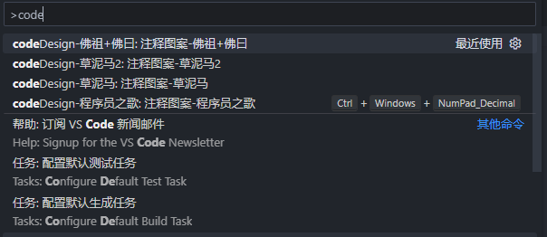

# vscode-插件使用

## javaScript 注释快捷键

单行注释

```shell
ctrl + /
```

多行注释

```shell
# win版 
alt + shit + A 
# mac版 
option + shift + A
```


## 函数注释插件 koroFielHeader

文件注释快捷键 `Ctrl + win + i`

函数注释快捷键 `Ctrl + win + T`

单行注释快捷键 `Ctrl + /`

程序员之歌快捷键 `Ctrl + win + .`


有趣注释

`ctrl + shift + p`

输入 `code` 就可以搜索到很多有趣的注释了

	


## 打印插件 Turbo Console Log

选中 要打印的变量 `Ctrl + Alt + L`


## 从浏览器打开 html 插件 Live Server

直接 右键打开 `open with live server`

或者 在右下角点击 `Go Live`

右键插件 -> 扩展设置 -> Live Server > Settings: Custom Browser -> chrome

这个 插件打开 `HTML` 是以服务器形式打开


## ESlint 报错解决

解决 VSCode 报 Delete eslint (prettier/prettier) 问题

```shell
npm run lint --fix
```


## 图表绘制插件

`Draw.io Integration`

安装完成后，创建 `.dio` 、`.drawio` 或`.drawio.png` 文件，就可以进行绘制图画了 
