# Nestjs

## 1. 基本配置

### 1.1 数据库配置

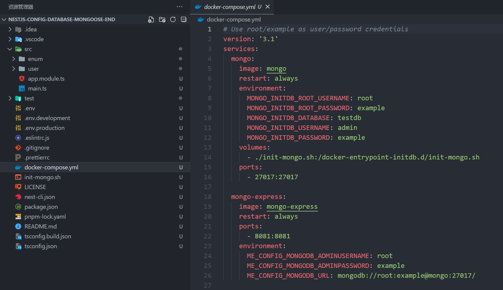


```shell
# 安装数据库
docker-compose up -d
```


### 1.2 环境变量配置

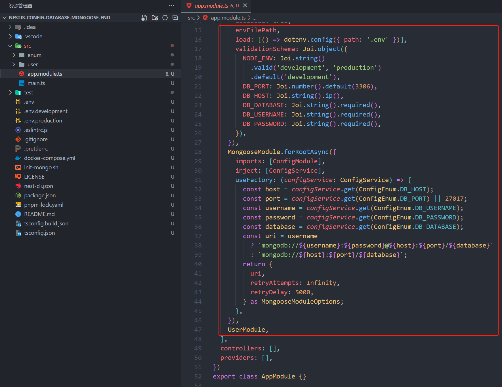


### 1.3 每个文件功能

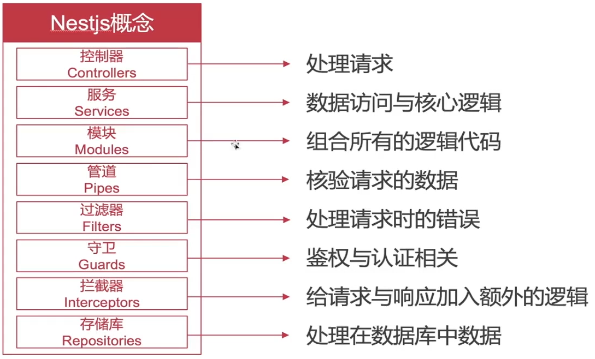	


`entity` 定义表结构

`service` 数据库操作

`controller` 前端传过来的数据校验，传回去的数据处理

`module` 模块导入

## 2. 数据之间的关系

### 2.1 文档

[TypeORM 中文网](https://typeorm.bootcss.com/select-query-builder)


## 3. 日志

### 3.1 记录日志

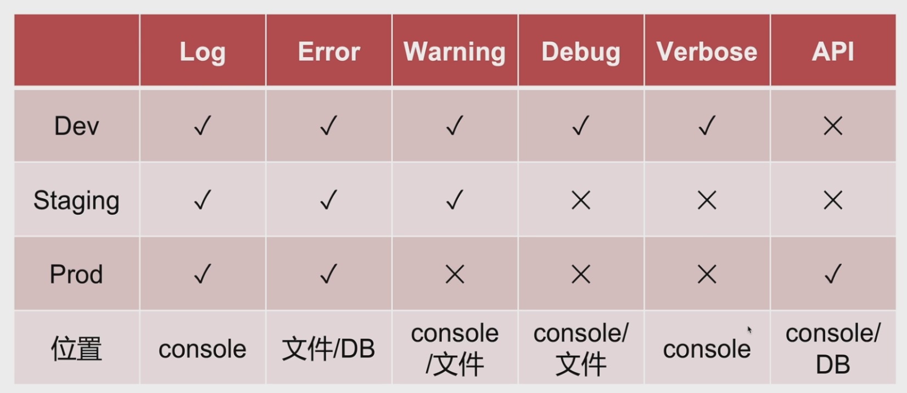


## 4. 获取前端传过来的参数

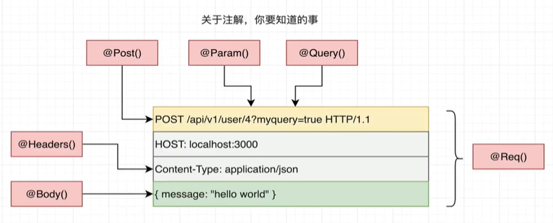	


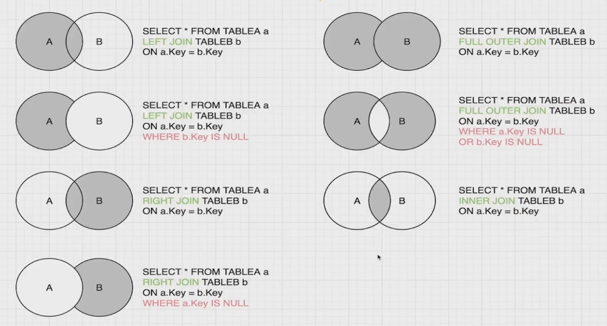


## 5. 数据校验插件

[validator 数据校验插件](https://www.npmjs.com/package/validator)


## 6. 创建 filters 文件

```shell
# 查看创建 filters 文件会产生哪些文件
nest g f filters/typeorm --flat -d
# 忽略 spec 文件
nest g f filters/typeorm --flat --no-spec
```


## 7. cli 创建命令

```shell
# --spec 和 --no-spec 表示不带测试文件，
# --flat 和 --no-flat 是指定是否生成对应目录的
# --skip-import  是指定不在 AppModule 里引入

# 1. 创建 module，加 -d 即是查看，不直接创建
nest g module user --no-spec

# 2. 创建 controller, 不带 测试文件
nest g controller user --no-spec

# 3. 创建 service, 不带测试文件
nest g service user --no-spec

# 一次性创建所有文件
nest g resource menus --no-spec
# 也可以简写
nest g res menus --no-spec
```


## 8. 删除的区别

1.remove 可以一次性删除单个或者多个实例; 并且 remove 可以触发 BeforeRemove, AfterRemove 钩子

```javascript
await repository.remove(user)
await repository.remove([user1, user2,user3])
```


2.delete 可以一次性删除单个或者多个 id 实例，或者给定条件

```javascript
await repository.delete(1)
await repository.delete([1, 2, 3])
await repository.delete({username: toimc})
```


## 9. 管道类型

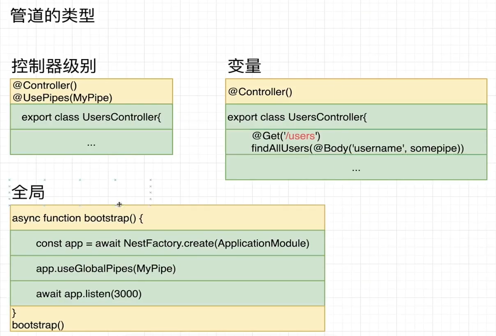


### 9.1 管道分类：

全局级别：所有经过全局的数据都会被识别

控制器级别：所有经过控制器的数据都会被识别

变量级别：所有经过接口的数据都会被识别，主要用于，转换、识别


### 9.2 创建管道的过程

1. 全局配置管道
2. 创建 class 类，即 Entity，DTO
3. 设置校验规则
4. 使用该实体类或者 DTO


## 10. JWT

### 10.1 JWT 流程图

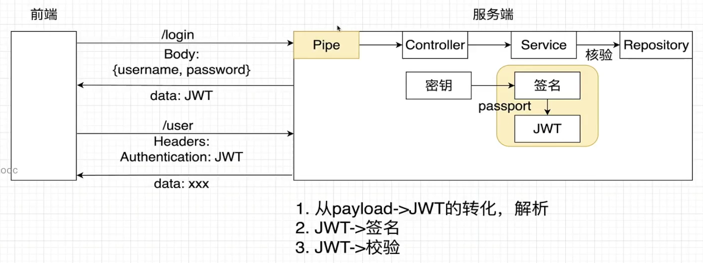


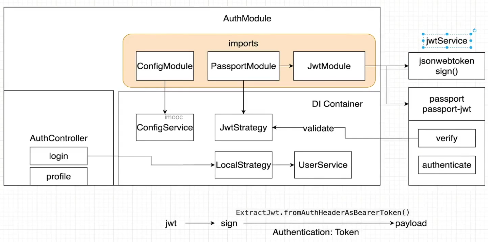


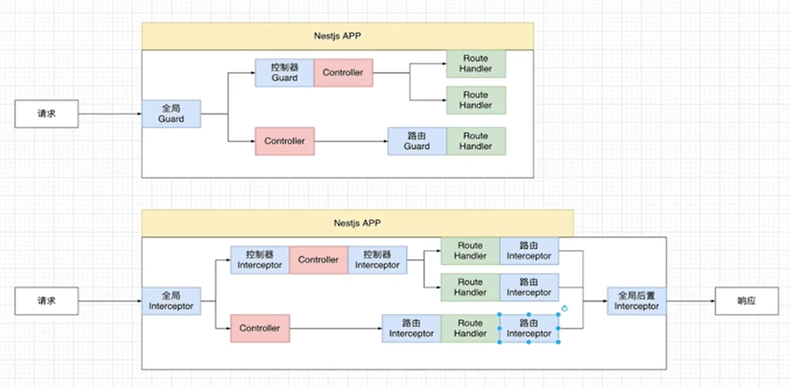


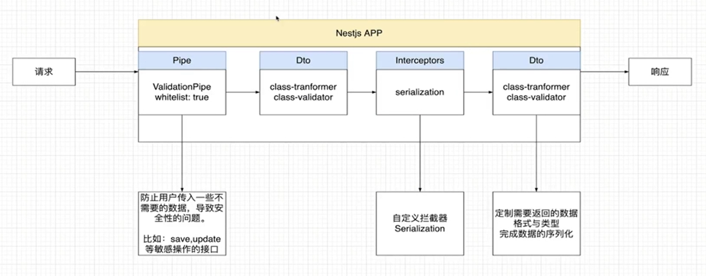


## 11. 生产环境配置

### 11.1 安装 node 环境 数据库环境

```shell
# 1. nvm 安装
curl -o- https://raw.githubusercontent.com/nvm-sh/nvm/v0.39.5/install.sh | bash

# 2. 查看 nvm 版本
nvm --version

# 3. 查看 node 可安装版本
nvm ls-remote 

# 4. node 安装
nvm install 14.21.3

# 5. 查看已下载 node
nvm list

# 6. 查看 node npm 版本
node -v
npm -v

# 7. 安装 cnpm
npm install -g cnpm --registry=https://registry.npmmirror.com

# 8. 安装 nrm 管理 下载源
cnpm i -g nrm

# 9. 切换淘宝源
nrm use taobao

# 10. 安装 pnpm
cnpm i -g pnpm

# 11. 安装 pm2
cnpm i -g pm2

# 12. 安装 docker-compose
curl -L https://get.daocloud.io/docker/compose/releases/download/v2.13.0/docker-compose-`uname -s`-`uname -m` > /usr/local/bin/docker-compose

chmod +x /usr/local/bin/docker-compose
```


>[nvm 安装文档](https://gitee.com/mirrors/nvm)
>
>[cnpm 镜像站](https://npmmirror.com/)
>
>[docker-ce docker国内镜像](https://mirrors.tuna.tsinghua.edu.cn/help/docker-ce/)


安装 docker 容器

```shell
# 创建 mysql 文件夹
cd /home
mkdir mysql

# 创建 docker-compose.yml 文件
# 复制下面 docker-compose.yml 中的内容
vi docker-compose.yml

# 安装环境
docker-compose up -d

# 查看服务是否运行
docker ps
```


docker ps 运行结果

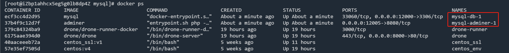


输入服务器地址即可访问数据库：`47.96.148.111:12005`


```yaml
# docker-compose.yml
version: '3.1'

services:
  db:
    image: mysql
    command: --default-authentication-plugin=mysql_native_password
    restart: always
    environment:
      MYSQL_ROOT_PASSWORD: dK%H^5D#Wu3PQXkPz2lM$0H#ryI1lDIg
      MYSQL_DATABASE: nestjs-backend
      MYSQL_USER: lin
      MYSQL_PASSWORD: i2Eiv1&VPiyWsdj@hQ%*gJbYX$KTWfgD
    volumes:
      - /home/mysql/db:/var/lib/mysql
    ports:
      - 12000:3306

  # navicat
  adminer:
    image: adminer
    restart: always
    ports:
      - 12005:8080
```


### 11.2 配置 github action + 阿里云 自动化部署

在 nest 项目中加入 `.github/workflows/deploy.yml`

其中 `deploy.yml` 可以随便起


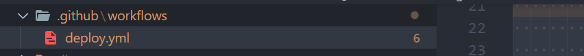	


```yaml
name: Deploy to CentOS Server # 这个脚本的描述

on: # 当合并到 master 分支，就开始执行下面脚本
  push:
    branches:
      - master

jobs:
  deploy: 
    # 定义job运行环境，使用linux环境
    runs-on: ubuntu-latest

    steps: # 检测代码
      - name: Checkout code
        uses: actions/checkout@v2
      # 拷贝文件到 服务器
      - name: Copy files to server
        uses: appleboy/scp-action@master
        with:
          host: ${{ secrets.SERVER_HOST }} # 主机名
          username: ${{ secrets.SERVER_USERNAME }} # 用户名
          password: ${{ secrets.SERVER_PASSWORD }} # 密码
          source: './'
          target: /home/apps-server/realworld-server/
      # 通过 SSH 连接服务器，并执行命令
      - name: SSH to server and restart application
        uses: appleboy/ssh-action@master
        with:
          host: ${{ secrets.SERVER_HOST }}
          username: ${{ secrets.SERVER_USERNAME }}
          password: ${{ secrets.SERVER_PASSWORD }}
          script: |
            cd /home/apps-server/realworld-server
            npm install
            npm run build
            pm2 start npm --name nest-backend -- run start:prod
```


配置 `SERVER_HOST`、`SERVER_USERNAME`、`SERVER_PASSWORD`

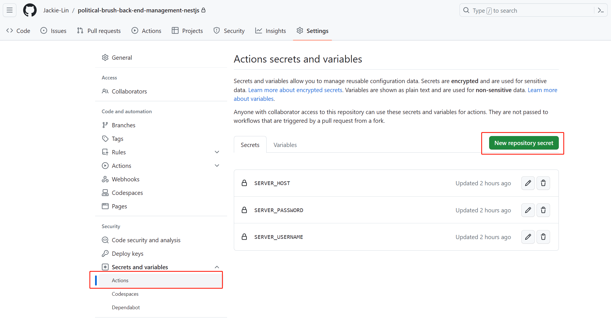

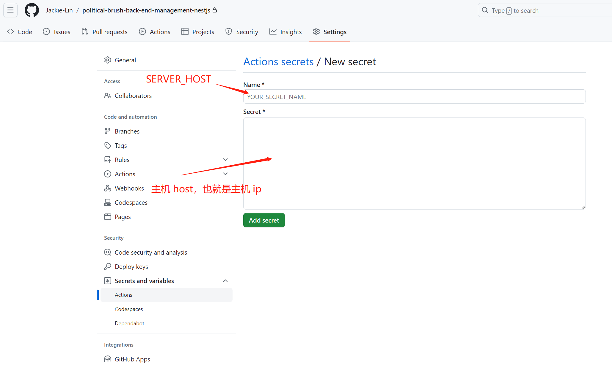


`SERVER_USERNAME`、`SERVER_PASSWORD` 也按上面的方式再创建一个即可


`SERVER_USERNAME` 通常默认就是 `root`

`SERVER_PASSWORD` 为主机密码


下图，为创建结果

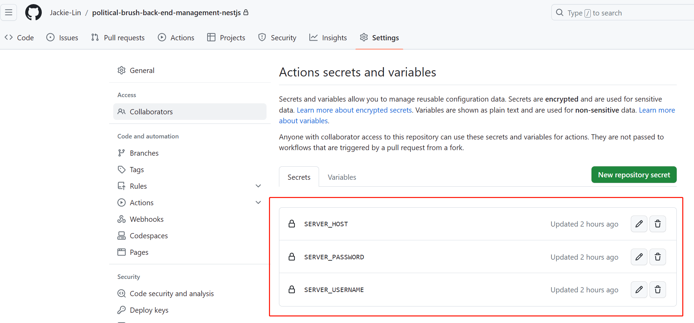


### 11.3 遇到的问题

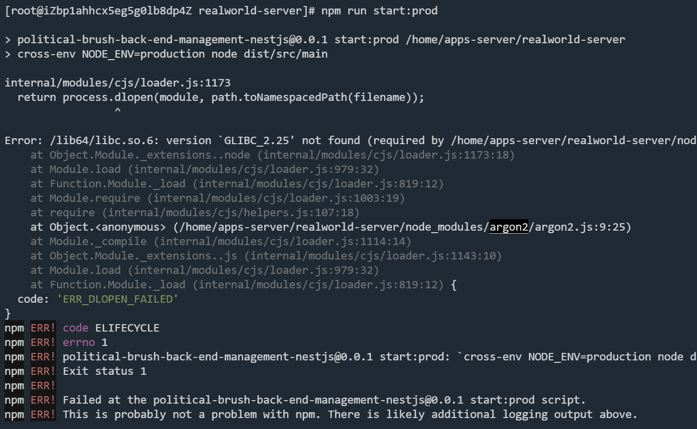

**【问题】**

Centos7 GLIBC_2.25 glibc 版本过低问题解决

**1. 升级 glibc 版本**

> 试过了，很危险，这个是很底层的东西，失误的话直接会导致，系统奔溃，而且麻烦，不推荐！

**2. 升级 系统版本**

我本来是 CentOS 7，直接升级 CentOS Stream 9，从根本上解决问题


## 12. pm2 操作

```shell
# 查看
pm2 list
pm2 status

# 停止服务 (1 为 id)
pm2 stop 1

# 删除服务
pm2 delete 1

# 执行服务，且开机自启
pm2 start npm --name nest-backend -- run start:prod
```


## 13. 宝塔

### 13.1 基本操作

```shell
# 打开宝塔 命令行
bt
```


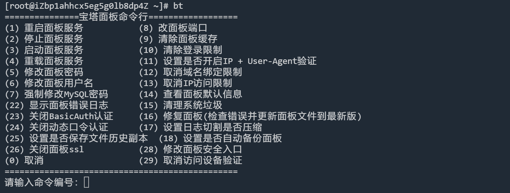


### 13.2 宝塔反向代理配置

配置反向代理，将本地端口，映射到域名上


1. 添加域名

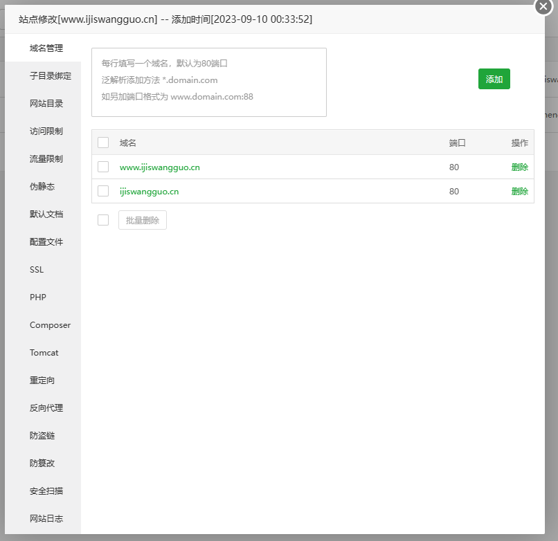	

2. 配置 ssl 证书，开启 https 访问

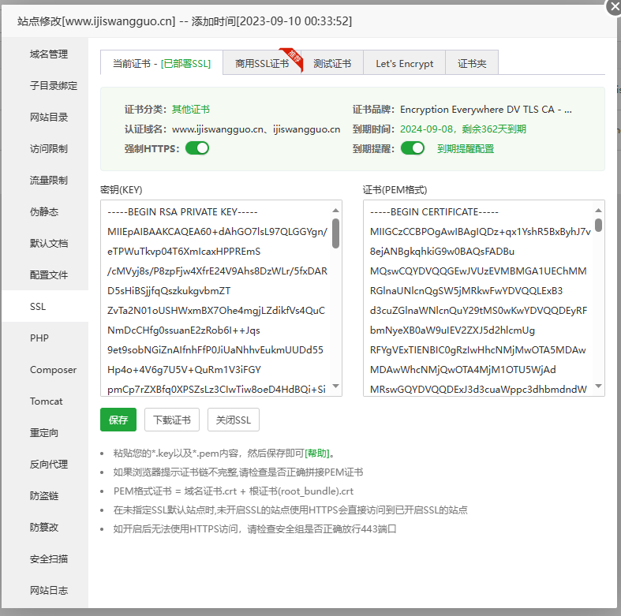	

3. 配置反向代理

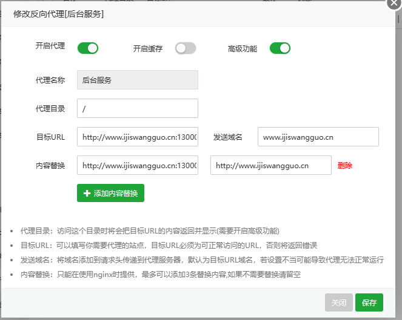	

4. 开启反向代理 ssl，开启 https 访问

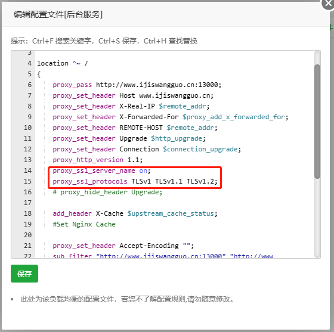		


### 13.3 docker 镜像下载加速

国内镜像：`https://registry.docker-cn.com`、`http://hub-mirror.c.163.com`

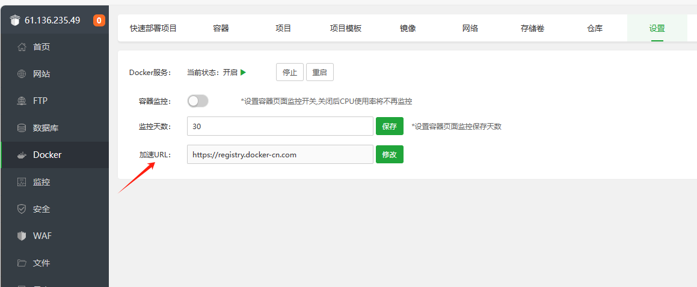


## 14. 数据库迁移

### 14.1 mysql 数据迁移

背景：两台云服务器，docker 中的 mysql 数据

工具：navicat 16.3.2

迁移方式：导出 sql，导入 sql


**导出** 

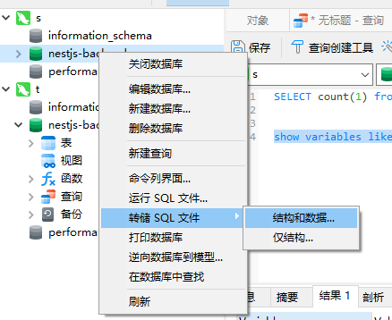	

**导入**

选择 刚才导出的 `.sql` 文件导入即可

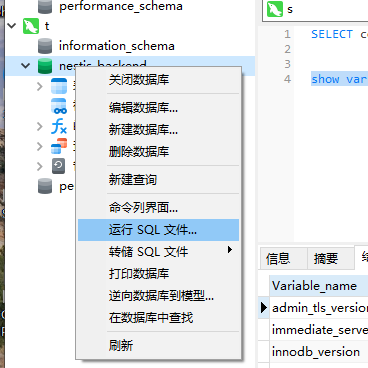	


**验证数据是否完整**

查询条数是否一致，使用 `sql` 语句：`SELECT count(1) from wx_users_like`

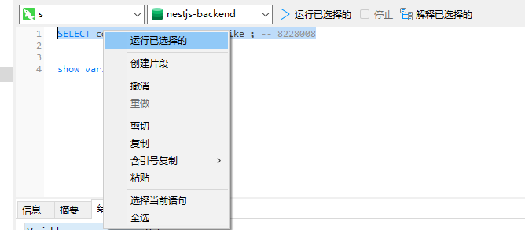	


查询数据库版本是否一致：`show variables like '%version%'`

可以看到数据库版本是 8.1.0

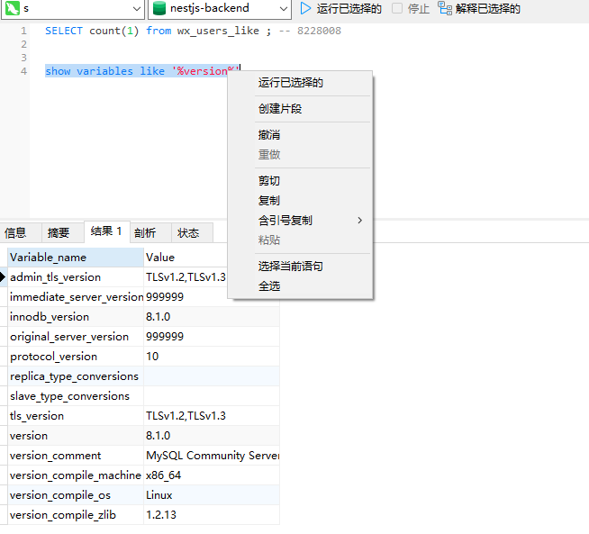	

### 14.2 redis 数据迁移

背景：两台云服务器，docker 中的 mysql 数据

工具：navicat 16.3.2

迁移方式：导出备份，执行备份文件


**新建备份**

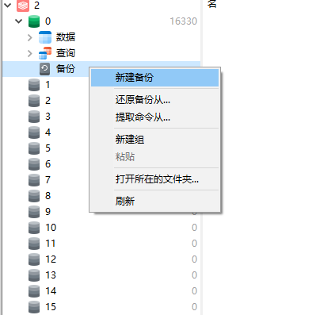	


**执行备份文件**

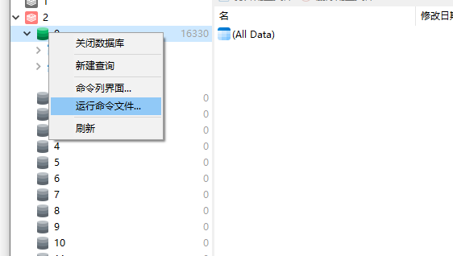	

## 15. 云服务器挂载 数据盘

### 挂载命令

如果使用正式版挂载失败，可以考虑使用后面的测试版，特别是安装过Windows系统的如果遇到无法挂载数据盘的情况可以考虑使用测试版脚本

**Centos/Fedora**

```shell
yum install wget -y && wget -O auto_disk.sh http://download.bt.cn/tools/auto_disk.sh && bash auto_disk.sh
#备用：
yum install wget -y && wget -O auto_disk.sh https://raw.githubusercontent.com/wn789/www/master/auto_disk.sh && bash auto_disk.sh
```

**Ubuntu**

```shell
wget -O auto_disk.sh http://download.bt.cn/tools/auto_disk.sh && sudo bash auto_disk.sh
#备用：
wget -O auto_disk.sh https://raw.githubusercontent.com/wn789/www/master/auto_disk.sh && sudo bash auto_disk.sh
```

**Debian**

```shell
wget -O auto_disk.sh http://download.bt.cn/tools/auto_disk.sh && bash auto_disk.sh
#备用：
wget -O auto_disk.sh https://raw.githubusercontent.com/wn789/www/master/auto_disk.sh && bash auto_disk.sh
```

挂载很简单，只需根据自己系统执行相对命令即可


## 16. 常见问题解决方法

1. 问题：数据库连接失败

   解决方案：因为删除某个模块导致报错，删除 `dist` ，重新打包，通常就能解决问题

   

2. 问题：明明 `.entity` 文件定义的字段不多，却表中莫名多了很多字段

   解决方案：因为去掉了一些字段，编译后的`dist`中没有去掉这些字段，导致重复创建，删除 `dist` ，重新打包，通常就能解决问题

