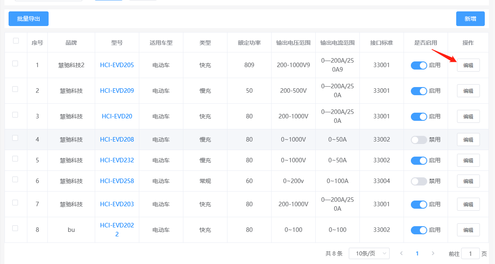
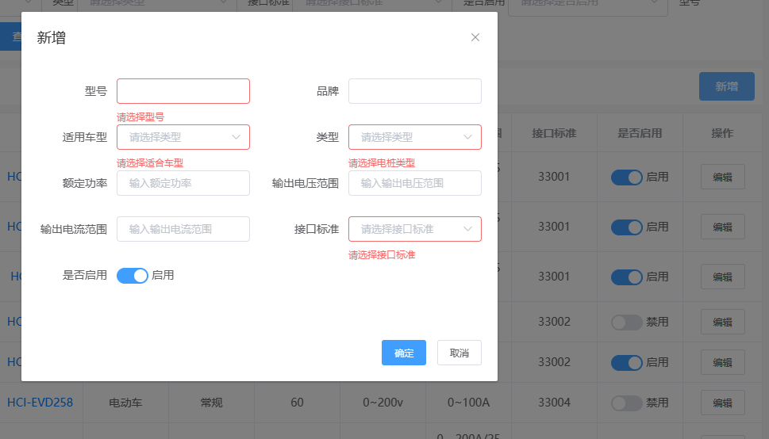

# element-ui 2.x 表单清空实现

## 问题




先点击编辑，再点击新增的时候需要 清空表单，就是把 form 内容直接初始化

```javascript
// 初始化 form
initForm() {
   vc.component.chargeTypeManger.form = {
      communityId: vc.getCurrentCommunity().communityId, //小区ID
      chargingName: null, //型号
      suitableModel: null, //适合车型
      pileType: null, //电桩类型
      outputPower: null, //额定功率
      outputVoltageRange: null, //输出电压范围
      outputCurrentRange: null, //输出电流范围
      interfaceStandard: null, //接口标准
      isEnable: "1", //是否启用（1：启用 2：禁用）
      brandName: null, // 品牌名称
   };
},
```


出问题了呀，表单是清空了，但是那个校验提示也出来了

	


## 解决办法

解决办法就是，在清空表单的同时也执行，form 表单自带的清空表单函数 `$that.$refs.ruleForm.resetFields();`[$that 就是 this]

清空要在前面，清除函数在后面才有效

实现如下，在每次关闭弹窗的时候就执行清空即可

```javascript
// 关闭弹窗 (解决 清空后还有校验提示的问题)
 closeChargeTypeInfoDialog() {
    vc.component.initForm();
    $that.$refs.ruleForm.resetFields();
    vc.component.chargeTypeManger.dialogVisible = false;
 },
```

