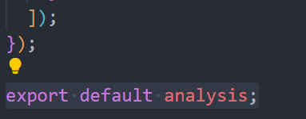

# nestjs爬取扇贝单词

## 创建项目

```shell
npx @nestjs/cli new crawler
```

	

```shell
npm run start # 启动项目，看到 Hello World!，就是启动成功了
```

·

## 分析页面结构

打开扇贝官网，点击分页，我们可以看到，每次点击分页都是去请求一次接口获取到数据的，那么我们要爬取的单词，直接从接口中获取就好了


那么问题来了，接口获取的数据都是加密的，这怎么搞


居然后端返回的加密的数据，那么解密一定是在前端实现，点开源代码


我们从最前面第一个函数开始 debug，找到了，解密函数


源代码被混淆过了，无法查看具体实现原理，但是我们不需要知道具体实现原理是什么，只要我们把代码全扣下来，直接调用即可


这个 `<script>` 中就包含了解密函数，我们把这一部分扣下来，新建一个 `.js` ，将代码放进去，修改下代码，把解密函数导出去

因为这是一个闭包函数，代码外面无法调用，所以要逆向这个函数

使用一个技巧，在外面定义一个变量接收这个函数，文件末尾导出

·

	


其他页面导入这个函数，并将接口拿到的数据解密即可

	

	


## 实现思路剖析


## 代码实现

## 总结


## 补充

纯 js 爬取单词

```javascript

(function () {
    var winw = window.open ("vocabulary.html",'new windiw',"scrollbars=yes,height=1000,width=500")
    var n = 0
    var b = document.getElementsByTagName('li')
    var n1 = Number(b[b.length-2].innerText)

    function get_next_page() {

        t3 = document.getElementsByClassName('index_word__3waO0')
        for (var i = t3.length - 1; i >= 0; i--) {
            text = t3[i].innerText.split('\n')
            t = text[0] +'     '+ text[1]
            winw.document.write(t)
            winw.document.write("</br>")
        }
        var b = document.getElementsByTagName('li')
        n = n+1
        n1 
        b[b.length-1].click()
        if (n>=n1) {
            clearInterval(num)
            console.log('循环结束，爬取完毕')
        }
    }
    num =setInterval(get_next_page,300)
})()
```


> 浏览器控制台，直接粘贴代码执行，就会爬取单词，放入新窗口