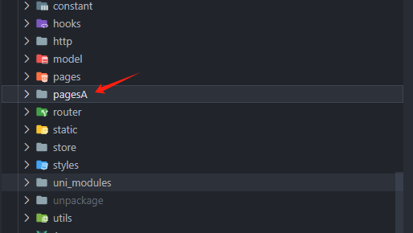
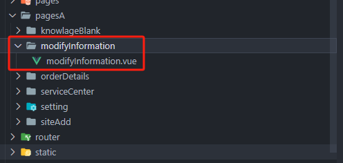
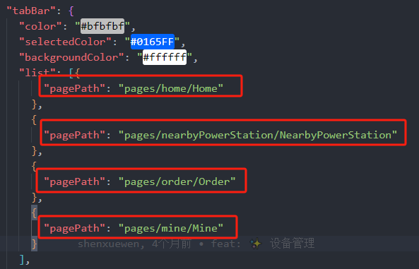

# uniapp-微信小程序分包

## 场景

因为 微信小程序上传有 大小限制，需要将代码包进行分包


## 分包步骤

1. 开启分包优化

```json
"mp-weixin": {
	"optimization":{"subPackages":true}
}
```

**[注意]**

只支持 mp-weixin、mp-qq、mp-baidu 的分包优化

分包的核心，分包`可以`使用 主包资源，主包`不可以`使用 分包资源


2. 新建分包文件夹，`pagesA`（可以是任意名称），当然啦，可以建立多个分包，也即是多建几个类似的文件夹

	


3. 将需要分包的页面，放在 `pagesA` 中，并修改 pages.json 文件 ( `tabBar` 相关页面不能分包，得在主包中)

例子：我们把 `modifyInformation` 放入 `pagesA` 中

	

接下来，就是修改 `modifyInformation` 在 `pages.json` 中的路径了

```json
// pages 中的路径
"pages": [
   {
        "path": "pages/modifyInformation/modifyInformation",
        "style": {
            "navigationBarTitleText": "修改信息"
        }
	},
]

// 将上面 pages 中的路径，移动到 subPackages 对应分包下的 pages 中
"subPackages": [
    {
      "root": "pagesA", // 分包的那个文件夹名称
      "pages": [
        {
          "path": "modifyInformation/modifyInformation", // 注意与 上面 pages 的路径做对比 (少了 根路径 pages/) 
          "style": {
            "navigationBarTitleText": "修改信息"
          }
        }
      ]
    }
]
```

最后呢，看看其他页面有没有跳转链接，跳到 `modifyInformation` 页面的

有的话，就得把路径修改下

```javascript
// 原有
uni.navigateTo({
  url: '/pages/modifyInformation/modifyInformation'
})

// 应改为
uni.navigateTo({
  url: '/pagesA/modifyInformation/modifyInformation'
})
```


【注意】这些就是 `tabBar` 页面

	
