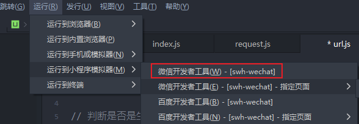
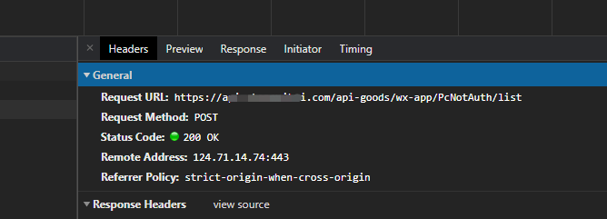
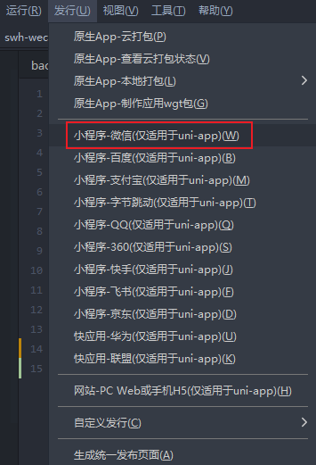
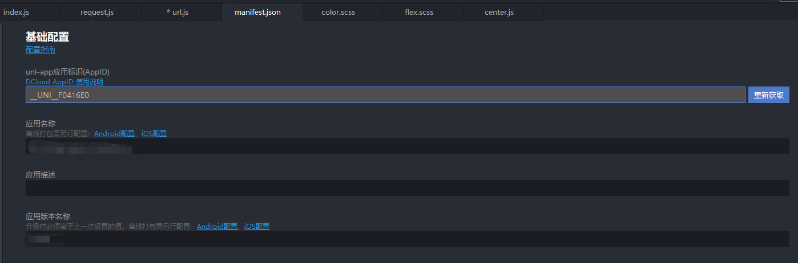

# uniapp-环境变量的使用

## 场景

在开发过程中，我们需要与后端联调，那么开发环境的 API 的地址就会与生产环境的 **基地址** 有所不同，我们每次开发和部署都去修改的话，就显得麻烦了

那有没有什么办法，让我们不需要没错都去修改呢，我们可以采用环境变量的方式，根据环境变量的不同，从而判断当前是处于哪个环境下，从而自动改变 **API 基地址**


## 配置

1. 先在建立一个文件 tool，并在文件夹中增加 添加一个存放工具函数的 base.js 文件，用于设置 **API 基地址**

```javascript
// 判断是否是生产环境
function isDevEnv() {
  return process.env.NODE_ENV === 'development'
}
// 网络请求地址 
export const baseUrl = isDevEnv() ? 
'http://192.168.0.1' : 'https://www.baodu.com'
```

其中 `process.env.NODE_ENV`有两个值，`development`、`production`


2. uniapp 点击发布 到 微信小程序

	

打包发布后，我们就能在 微信开发者工具中就可以看到, 我们代码的 **API基地址** 已经改变了

	


3. 如果需要生产环境的 **API基地址**，需要使用 发行，才能获取到 属于生产环境的环境变量

	

**[注意]**

发布可能需要刷新 uniapp 的应用标示，如果发布时有错误

可以尝试在 `manifest.json`中重新获取下 应用标示

