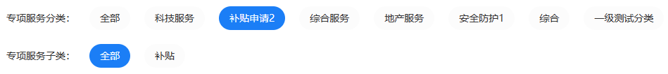

# Vue2.x 递归组件的使用

## 效果

	

## 实现

```vue
<!-- 递归组件 -->
<template>
  <div>
    <div
      class="multilayer-class-box"
      v-if="
        multilayerClass.classItemList &&
          multilayerClass.classItemList.length > 0
      "
    >
      <div>{{ multilayerClass.classTitleName }}：</div>
      <div class="button-box">
        <div
          @click="setmultilayerClassItem({})"
          class="button-box-item"
          :class="clicked === null ? 'button-box-item-clicked' : ''"
        >
          全部
        </div>
        <div
          v-for="item in multilayerClass.classItemList"
          :key="item.categoryId"
          class="button-box-item"
          :class="clicked === item.categoryId ? 'button-box-item-clicked' : ''"
          @click="setmultilayerClassItem(item)"
        >
          {{ item.serviceName }}
        </div>
      </div>
    </div>
    <div
      v-if="
        multilayerClassItem.classItemList &&
          multilayerClassItem.classItemList.length > 0
      "
    >
      <multilayer-class
        :multilayerClass="multilayerClassItem"
        @selectService="multilayerClassItem"
      ></multilayer-class>
    </div>
  </div>
</template>

<script>
import { bus } from "../../utils/bus";
export default {
  name: "multilayerClass",
  props: {
    multilayerClass: {
      type: Object,
      default: () => {}
    }
  },
  data() {
    return {
      multilayerClassItem: {},
      clicked: null
    };
  },
  methods: {
    // 设置 下一级分类
    setmultilayerClassItem(item) {
      item.categoryId
        ? (this.clicked = item.categoryId)
        : (this.clicked = null);
      item.children
        ? (this.multilayerClassItem = item.children)
        : (this.multilayerClassItem = {});
      bus.$emit("on-clicked", item);
    }
  }
};
</script>

<style scoped lang="less">
.multilayer-class-box {
  display: flex;
  width: 100%;
  align-items: center;
  margin: 20px 0;
}
.button-box {
  display: flex;
  .button-box-item {
    display: flex;
    align-items: center;
    border-radius: 30px;
    padding: 10px 15px;
    margin-left: 20px;
    background-color: #fcfcfc;
    color: #333333;
    cursor: pointer;
  }
  .button-box-item-clicked {
    color: #ffffff;
    background-color: #1b7ef6;
  }
}
</style>
```


## 调用

```vue
<!-- 调用页面 -->
<template>
	<div>
        <multilayer-class :multilayerClass="multilayerClass" /> 
    </div>
</template>
<script>
export default {
  components: {
    multilayerClass: () => import("../../components/multilayerClass")
  },
  data() {
    return {
      multilayerClass: {
        "categoryId": null,
        "classTitleName": "专项服务分类",
        "classItemList": [
            {
                "categoryId": 2,
                "serviceName": "科技服务",
                "children": {
                    "categoryId": 2,
                    "classTitleName": "专项服务子类",
                    "classItemList": [
                        {
                            "categoryId": 4,
                            "serviceName": "安全防护",
                            "children": null
                        },
                        {
                            "categoryId": 20,
                            "serviceName": "任务",
                            "children": null
                        },
                        {
                            "categoryId": 21,
                            "serviceName": "测试1",
                            "children": null
                        }
                    ]
                }
            },
            {
                "categoryId": 3,
                "serviceName": "补贴申请2",
                "children": {
                    "categoryId": 3,
                    "classTitleName": "专项服务子类",
                    "classItemList": [
                        {
                            "categoryId": 22,
                            "serviceName": "补贴",
                            "children": null
                        }
                    ]
                }
            },
            {
                "categoryId": 5,
                "serviceName": "综合服务",
                "children": {
                    "categoryId": 5,
                    "classTitleName": "专项服务子类",
                    "classItemList": []
                }
            },
            {
                "categoryId": 6,
                "serviceName": "地产服务",
                "children": {
                    "categoryId": 6,
                    "classTitleName": "专项服务子类",
                    "classItemList": []
                }
            },
            {
                "categoryId": 12,
                "serviceName": "安全防护1",
                "children": {
                    "categoryId": 12,
                    "classTitleName": "专项服务子类",
                    "classItemList": []
                }
            },
            {
                "categoryId": 14,
                "serviceName": "综合",
                "children": {
                    "categoryId": 14,
                    "classTitleName": "专项服务子类",
                    "classItemList": [
                        {
                            "categoryId": 13,
                            "serviceName": "企业服务1",
                            "children": null
                        }
                    ]
                }
            },
            {
                "categoryId": 24,
                "serviceName": "一级测试分类",
                "children": {
                    "categoryId": 24,
                    "classTitleName": "专项服务子类",
                    "classItemList": [
                        {
                            "categoryId": 27,
                            "serviceName": "二级测试分类",
                            "children": null
                        }
                    ]
                }
            }
        ]
    }
},
created() {
    this.getCategoryTree();
    bus.$on("on-clicked", item => {
      console.log(item);
    });
  },
};
</script>
```


**[注]**

这个递归组件核心的点

- 递归组件，自己要调用自己
- `multilayerClass` 数据格式要符合，递归组件功能要求