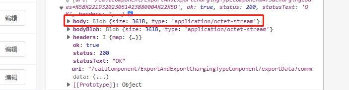

# 前端文件流下载实现

## 场景

后端传过来一个文件流，前端要如何进行下载保存呢


## 实现

定义一个全局下载函数

```javascript
// 下载文件的方法
downLoad: function (data, type, filename) {
     // 创建blob对象，解析流数据
     const blob = new Blob([data], {
       // 设置返回的文件类型
       // type: 'application/pdf;charset=UTF-8' 表示下载文档为pdf，如果是word则设置为msword，excel为excel
       type: type,
     });
     // 这里就是创建一个a标签，等下用来模拟点击事件
     const a = document.createElement("a");
     // 兼容webkix浏览器，处理webkit浏览器中href自动添加blob前缀，默认在浏览器打开而不是下载
     const URL = window.URL || window.webkitURL;
     // 根据解析后的blob对象创建URL 对象
     const herf = URL.createObjectURL(blob);
     // 下载链接
     a.href = herf;
     // 下载文件名,如果后端没有返回，可以自己写a.download = '文件.pdf'
     a.download = filename;
     document.body.appendChild(a);
     // 点击a标签，进行下载
     a.click();
     // 收尾工作，在内存中移除URL 对象
     document.body.removeChild(a);
     window.URL.revokeObjectURL(herf);
},
```


调用方式

1. 先设置 `responseType: "blob"`
2. 获取 后端传过来的文件名
3. 设置 文件类型
4. 将 **Blob 数据**、**文件类型**、**文件名** 传进行函数中 (注意这样函数需要的数据，是 Blob 数据，不是后端直接传过来的所有数据流)

	

```javascript
// 批量导出 (不要在意请求方式，知道核心内容即可)
ExportAll() {
    var param = {
      responseType: "blob", // 文件下载最重要的事 要设置 这个参数
      params: {
        communityId: vc.getCurrentCommunity().communityId, //小区ID
        chargingCodes: JSON.stringify(
          vc.component.chargeTypeManger.selectionArr
        ),
      },
    };
    vc.http.get(
      "ExportAndExportChargingTypeComponent",
      "exportData",
      param,
      function (json, res) {
        // 获取后端传过来的文件名
        const fileName = res.headers.map["content-disposition"][0]
          .split(";")[1]
          .split("filename=")[1];
        // 文件类型设置
        const type = "application/excel;charset=UTF-8";
        // 文件流数据
        const data = res.body;
        vc.http.downLoad(data, type, fileName);
      },
      function (errInfo, error) {
        console.log("请求失败处理");
      },
      true
    );
},
```

