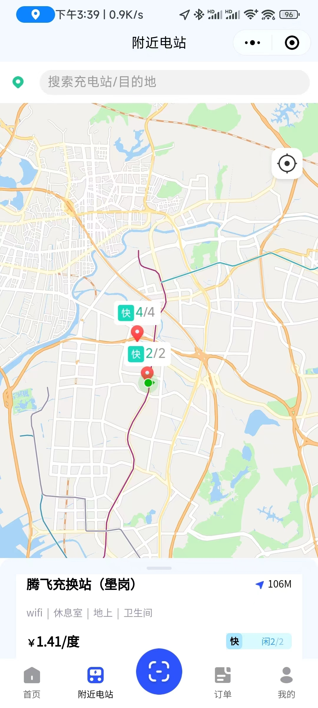

# 微信小程序地图自定义坐标实现

## 实现目标

	

1. 地图中坐标点绘制，并可点击切换样式

## 思路与问题、及解决方案

### cover-view 批量显示在 map 中

一开始直接在 `map` 中定义 `cover-view` 并将 在 `v-for` 写在 `cover-view`上

结果 `marker` 都不显示了，查看资料说循环渲染，需要套在 `block` 中

套了，结果不负众望，显示出来了

### marker 无点击事件

采用 `<cover-view slot="callout">` 绘制，自定义 `marker`，然而我们需要点击`marker`的图标

会出现显示对应电站的信息的弹窗

一开始的方案是，给每个 `marker` 都使用`bindtap`，绑定一个点击事件

从而获取对应的坐标点信息，判断要修改哪个`marker`的样式

但是微信小程序中的采用 `cover-view` ，自定义的 `marker` 无法通过，`bindtap`绑定点击事件

对此，我们放弃这种方式，采用 `map` 自带的 `bindcalloutap` 事件，该事件能获取所点击 `marker` 的

`markerId`，我们再根据`markerId`，以及动态 `class` 进行样式切换

## 总结

微信小程序的自定义 `marker`，一般使用 `cover-view` 进行自定义

注意，`cover-view` 循环渲染，得套在 `block` 中

`<cover-view>` 无法通过 `bindtap` 绑定事件

但是可以通过 `map` 的 `bindcalloutap` 获取到 `markerId` 进行判断，点击位置