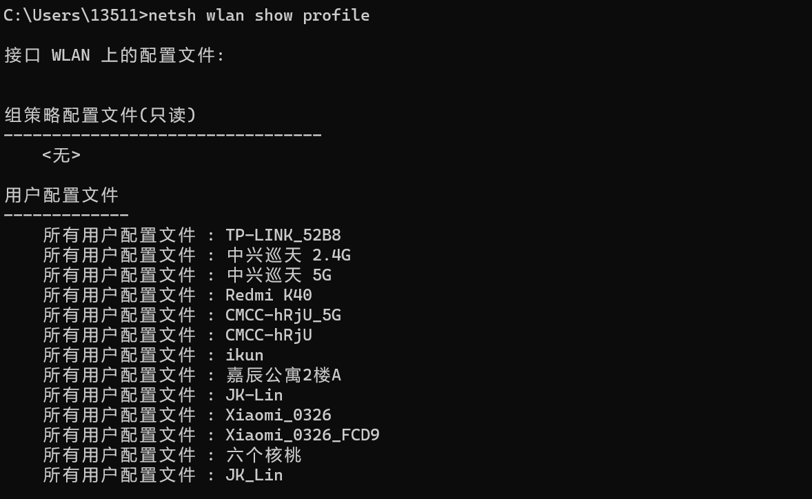
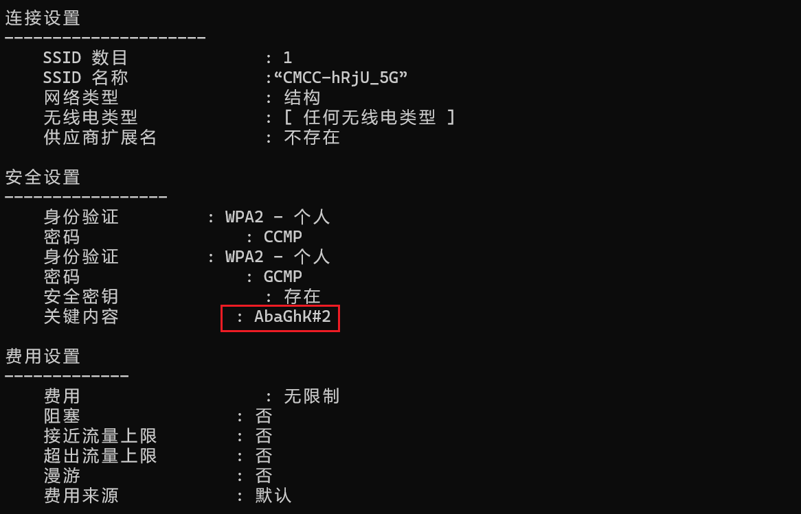

# wifi 密码

## windows 查看 wifi 账号

```cmd
netsh wlan show profile
```

	

## 查看 wifi 密码

```cmd
netsh wlan show profile name=CMCC-hRjU_5G key=clear
```

`CMCC-hRjU_5G` 就是 wifi账号名，这个关键内容就是 wifi 密码了

