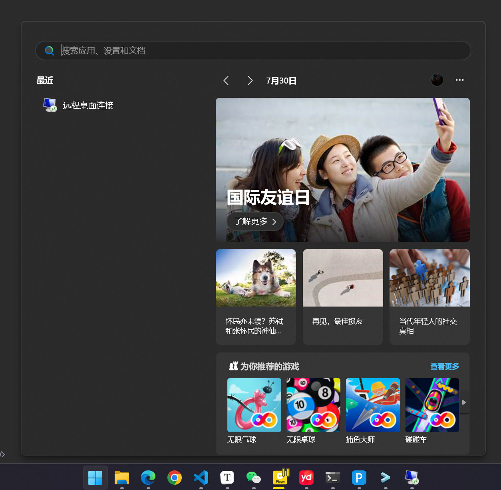
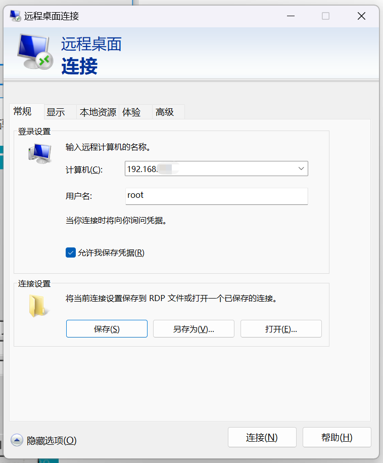

# window11 使用技巧

## 家庭版如何使用 自带远程连接工具 连接 CenterOS

1. 直接搜索，就可找到，远程连接工具

	

2. CenterOS 安装插件

```shell
# 安装epel库
yum install epel-release

# 安装xrdp
yum install xrdp

# 因为Xrdp最终会自动启用VNC，所以必须安装tigervnc-server，否则xrdp无法使用。安装vnc
yum install tigervnc-server

# 为root用户设置VNC密码
vncpasswd root

# 关闭防火墙
systemctl stop firewalld.service

# 设置开机不启动防火墙
systemctl disable firewalld.servie

# 启动XRDP
systemctl start xrdp

# 设置开机自启动
systemctl enable xrdp
```


3. 直接连接即可

	


> **[注意]**
>
> 如果 还是不行，很有可能就是 安装其他防火墙，比如 小皮面板 的防火墙，只要关了就可以连接上了


## window11 添加 vscode 进入 右键菜单 (命令行的方法修改)

1. 新建一个 空白文件，写入下面代码

```javascript
Windows Registry Editor Version 5.00
 
[HKEY_CLASSES_ROOT\*\shell\VSCode]
@="Open with Code"
"Icon"="D:\\software\\Microsoft VS Code\\Code.exe"
 
[HKEY_CLASSES_ROOT\*\shell\VSCode\command]
@="\"D:\\software\\Microsoft VS Code\\Code.exe\" \"%1\""
 
Windows Registry Editor Version 5.00
 
[HKEY_CLASSES_ROOT\Directory\shell\VSCode]
@="Open with Code"
"Icon"="D:\\software\\Microsoft VS Code\\Code.exe"
 
[HKEY_CLASSES_ROOT\Directory\shell\VSCode\command]
@="\"D:\\software\\Microsoft VS Code\\Code.exe\" \"%V\""
 
Windows Registry Editor Version 5.00
 
[HKEY_CLASSES_ROOT\Directory\Background\shell\VSCode]
@="Open with Code"
"Icon"="D:\\software\\Microsoft VS Code\\Code.exe"
 
[HKEY_CLASSES_ROOT\Directory\Background\shell\VSCode\command]
@="\"D:\\software\\Microsoft VS Code\\Code.exe\" \"%V\""
```

2. 修改路径 `D:\\software\\Microsoft VS Code\\Code.exe` 为你电脑上 vscode 的安装路径，这里使用 双 `\\` 代替 `\`
3. 写完将文件名改为，`xxx.reg` 保存，双击运行即可

