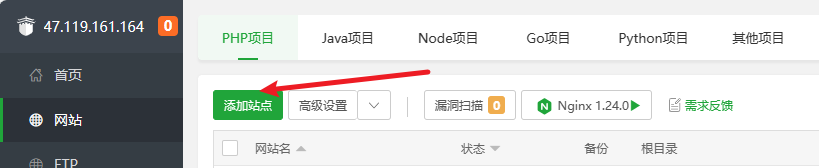
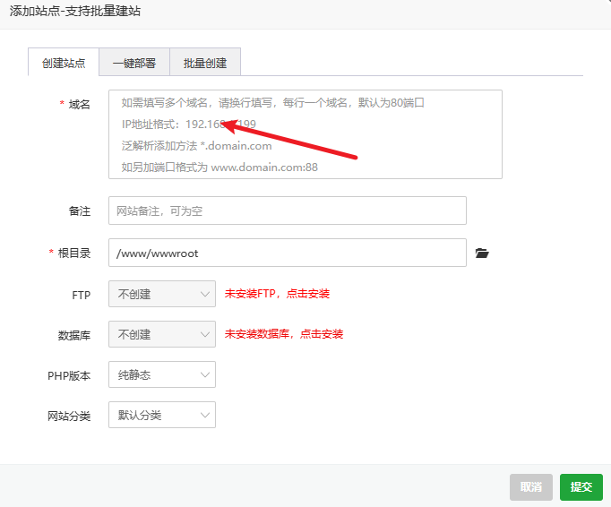
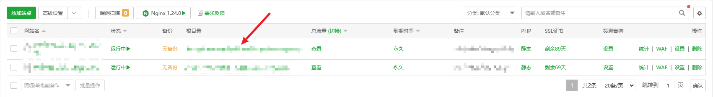
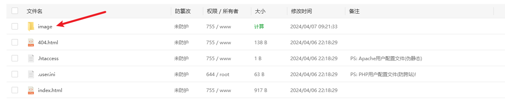
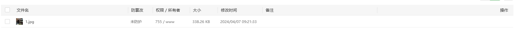
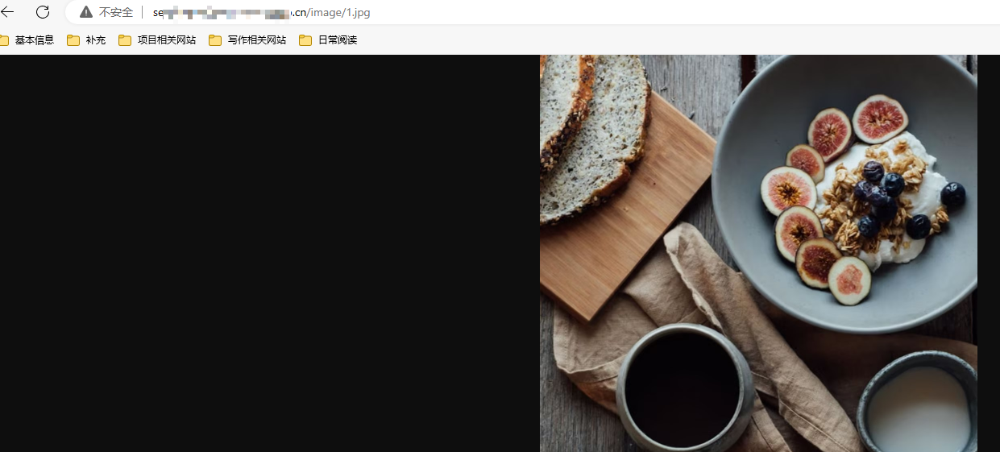
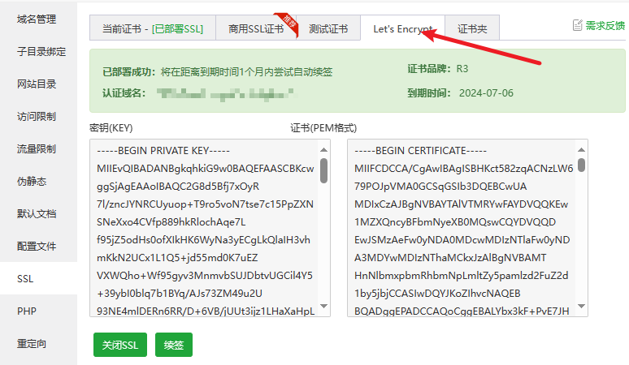
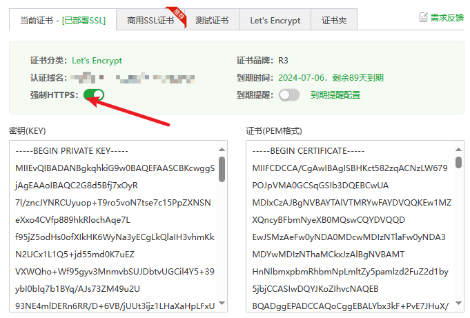

# 宝塔使用技巧

## 配置静态文件资源

1. 直接添加站点

	

2. 填写域名

	

3. 添加后进入，目录页

4. 创建 `image` 文件夹，将图片放进入

5. 使用刚才的 `域名` + `/image/1.jpg` 访问看看，可以看到已经访问到了，但是显示不安全，原因是没有开启 `https`

6. 开启 `https`，我们需要申请证书，使用 `Let‘s Encrynt` 申请证书，再开启 `强制 HTTPS` 就可以使用 `https` 访问了

	

	