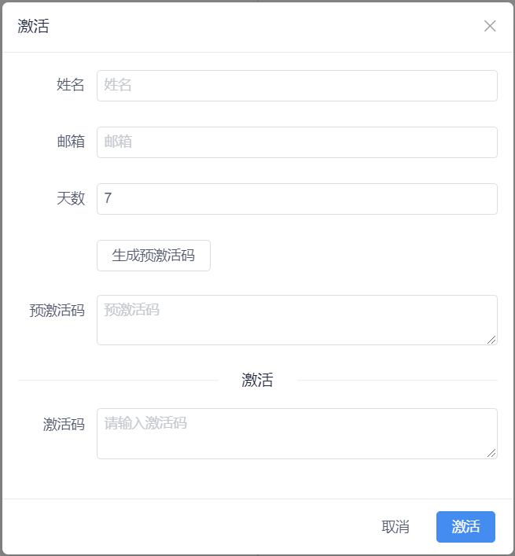
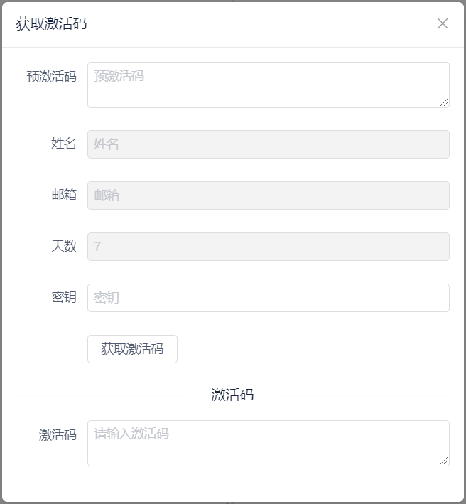

# 简单的激活码机制

# 前言

使用Electron开发客户端的时候，我们可以做在线激活，也可以做本地激活，这里我们就先实现一个本地激活的方式。

# 获取MAC地址

安装依赖

```shell
npm install getmac --save
```

代码

```javascript
const getMac = require("getmac").default;
let clientId = getMac();
console.log("本机mac地址：", clientId);
```

获取到的结果如下

> 本机mac地址： 00:ff:63:f9:b4:ef

# 加解密

## AES加解密

添加依赖

```shell
npm install crypto-js --save
```

aes_ecb.js

```javascript
const CryptoJS = require("crypto-js");

let keystr = "JIANXINGZHEPSVMC";

// 字符串转hex
let string_to_hex = function(str) {
  let tempstr = "";
  for (let i = 0; i < str.length; i++) {
    if (tempstr === "") tempstr = str.charCodeAt(i).toString(16);
    else tempstr += str.charCodeAt(i).toString(16);
  }
  return tempstr;
};

function encStr(src) {
  let key = string_to_hex(keystr);

  key = CryptoJS.enc.Hex.parse(key);
  const enc = CryptoJS.AES.encrypt(src, key, {
    mode: CryptoJS.mode.ECB,
    padding: CryptoJS.pad.Pkcs7
  });

  return enc.ciphertext.toString();
}

function decryptStr(enced) {
  let key = string_to_hex(keystr);

  key = CryptoJS.enc.Hex.parse(key);
  const dec = CryptoJS.AES.decrypt(CryptoJS.format.Hex.parse(enced), key, {
    mode: CryptoJS.mode.ECB,
    padding: CryptoJS.pad.Pkcs7
  });

  return CryptoJS.enc.Utf8.stringify(dec);
}

export { encStr, decryptStr };
```

调用

```javascript
import {encStr} from "./utils/aes_ecb";
let str = encStr("123456");
```

## MD5加密

### 方式1

md5.js

```javascript
const CryptoJS = require("crypto-js");
const md5 = str => CryptoJS.MD5(str).toString();
export { md5 };
```

使用

```javascript
import { md5 } from "./utils/md5";
let str = md5("123456");
```

### 方式2

安装md5加密

```shell
npm install md5-node --save
```

测试

```javascript
const md5 = require("md5-node");
console.log(md5('123456'));
```

# 激活码算法

## 预激活码

预激活码是用户提供的，用户发送给激活人员，生成激活码后再把激活码发给用户。

因为没有云服务器，所以我们必须用户能提供必要的信息，这里主要需要用户的`MAC地址`和`激活的天数`

```javascript
const getMac = require("getmac").default;
import { encStr, decryptStr } from "./utils/aes_ecb";

let clientId = getMac();
console.log("本机mac地址：", clientId);

let actmsg = {
  name: "码客说",
  email: "183518918@qq.com",
  mac: clientId,
  days: 10
};

let str_enc = encStr(JSON.stringify(actmsg));
console.info("加密后：" + str_enc);

let str_dec = decryptStr(str_enc);
console.info("解密后：" + str_dec);
```

可以看到结果

```javascript
本机mac地址： 00:ff:63:f9:b4:ef
加密后：b9fd9ea920a9b236603e182b1b642779fc76300f508d5c5883dc7c1228e500d3c7631f52730ee450ecb1e4bf1a71d533770944250bff0f91f438cd11275c5424986ef9c2c
6e7107b00a4032bc5304f82036dfca05b9c3874f6e7b89dcd82de8e
解密后：{"name":"码客说","email":"183518918@qq.com","mac":"00:ff:63:f9:b4:ef","days":10}
```

这样我们需要用户把加密后的字符串发送过来就可以了。我们就可以获取到用户的基本信息了，其中name和email是用来辨别身份的，和激活码的生成无关。

## 生成激活码

```javascript
let time_begin = Date.parse(new Date()) / 1000;
console.info("开始时间：" + time_begin);

let time_end = Date.parse(new Date()) / 1000 + 10 * 24 * 60 * 60;
console.info("结束时间：" + time_end);

let actmsg2 = {
  name: "码客说",
  email: "183518918@qq.com",
  mac: clientId,
  days: 10,
  time_begin: time_begin,
  time_end: time_end
};
let str_enc2 = encStr(JSON.stringify(actmsg2));
console.info("加密后：" + str_enc2);

let str_dec2 = decryptStr(str_enc2);
console.info("解密后：" + str_dec2);
```

结果

```javascript
开始时间：1645938395
结束时间：1646802395
加密后：b9fd9ea920a9b236603e182b1b642779fc76300f508d5c5883dc7c1228e500d3c7631f52730ee450ecb1e4bf1a71d533770944250bff0f91f438cd11275c5424986ef9c2c
6e7107b00a4032bc5304f824eb4e57bc89ff8310de921754e0077f6aaa6833d2ef4df743a9b4724b62952b3809135a6f4617db05c3d550294fcadb7efead132446d947aac6f99ca54
896c34
解密后：{"name":"码客说","email":"183518918@qq.com","mac":"00:ff:63:f9:b4:ef","days":10,"time_begin":1645938395,"time_end":1646802395}
```

我们就可以把加密后的字符串作为激活码发送给用户了。

这样这个激活码不但限制了使用的设备，还限制了使用的时间。

## 日期加密

上面其实已经可以了，但是我们必须再开发一个专门生成激活码的应用，这里图省事，就直接把激活码生成器放在了程序中，但是不能让用户也能生成，这里就设计了一个加密的算法，每隔一个小时自动变更，这样我们可以输入日期密码，进入激活码的生成页面。

date_enc.js

```javascript
import { md5 } from "./md5";

Date.prototype.format = function(fmt) {
  var o = {
    "M+": this.getMonth() + 1, //月份
    "d+": this.getDate(), //日
    "h+": this.getHours(), //小时
    "m+": this.getMinutes(), //分
    "s+": this.getSeconds(), //秒
    "q+": Math.floor((this.getMonth() + 3) / 3), //季度
    S: this.getMilliseconds() //毫秒
  };
  if (/(y+)/.test(fmt))
    fmt = fmt.replace(
      RegExp.$1,
      (this.getFullYear() + "").substr(4 - RegExp.$1.length)
    );
  for (var k in o)
    if (new RegExp("(" + k + ")").test(fmt))
      fmt = fmt.replace(
        RegExp.$1,
        RegExp.$1.length === 1 ? o[k] : ("00" + o[k]).substr(("" + o[k]).length)
      );
  return fmt;
};

function date_enc() {
  var miwen1 = new Date().format("yyyyMMddhh");

  var mystr = miwen1
    .split("")
    .reverse()
    .join("");
  mystr = "xhkj" + mystr;
  mystr = md5(mystr);
  if (mystr.length > 6) {
    mystr = mystr.substring(0, 6);
  }
  return mystr;
}

export { date_enc };
```

调用

```javascript
import { date_enc } from "./utils/date_enc";
console.info("日期加密：" + date_enc());
```

# 系统对接

这种激活方法的弊端在于用户如果修改本地时间就可以一直使用。

## 页面效果

激活页面

[](http://image.psvmc.cn/blog/20220227152327.png!github)

获取激活码页面

[](http://image.psvmc.cn/blog/20220228100458.png!github)

## 渲染进程

渲染进程页面

```vue
<div>
  <Button
          type="primary"
          @click="jihuo_dialog_click"
          style="margin-right: 10px;margin-left: 10px"
          >激活
  </Button>
  <Button
          type="primary"
          @click="jihuo_tool_dialog_click"
          style="margin-right: 10px;"
          >获取激活码
  </Button>
</div>
<Modal v-model="show_jihuo" title="激活" ok-text="激活" @on-ok="jihuo_ok">
  <Form :model="jihuo_obj" :label-width="80">
    <FormItem label="姓名">
      <Input v-model="jihuo_obj.name" placeholder="姓名" />
    </FormItem>
    <FormItem label="邮箱">
      <Input v-model="jihuo_obj.email" placeholder="邮箱" />
    </FormItem>
    <FormItem label="天数">
      <Input v-model="jihuo_obj.days" placeholder="天数" type="number" />
    </FormItem>
    <FormItem label="">
      <Button @click="genate_yujihuo">生成预激活码</Button>
    </FormItem>
    <FormItem label="预激活码">
      <Input
             v-model="jihuo_obj.source"
             placeholder="预激活码"
             type="textarea"
             />
    </FormItem>
    <Divider>激活</Divider>
    <FormItem label="激活码">
      <Input
             v-model="jihuo_obj.code"
             type="textarea"
             placeholder="请输入激活码"
             />
    </FormItem>
  </Form>
</Modal>

<Modal v-model="show_jihuo_tool" title="获取激活码" :footer-hide="true">
  <Form :model="jihuo_obj" :label-width="80">
    <FormItem label="预激活码">
      <Input
             v-model="jihuo_obj.source"
             placeholder="预激活码"
             type="textarea"
             @on-change="jihuo_pre_change"
             />
    </FormItem>

    <FormItem label="姓名">
      <Input v-model="jihuo_obj.name" placeholder="姓名" disabled />
    </FormItem>
    <FormItem label="邮箱">
      <Input v-model="jihuo_obj.email" placeholder="邮箱" disabled />
    </FormItem>
    <FormItem label="天数">
      <Input
             v-model="jihuo_obj.days"
             placeholder="天数"
             disabled
             type="number"
             />
    </FormItem>

    <FormItem label="密钥">
      <Input v-model="jihuo_obj.key" placeholder="密钥" />
    </FormItem>

    <FormItem label="">
      <Button @click="get_act_code">获取激活码</Button>
    </FormItem>
    <Divider>激活码</Divider>
    <FormItem label="激活码">
      <Input
             v-model="jihuo_obj.code"
             type="textarea"
             placeholder="请输入激活码"
             />
    </FormItem>
  </Form>
</Modal>
```

渲染进程JS

```javascript
const md5 = require("md5");
const { ipcRenderer } = window.require("electron");

export default {
  name: "App",
  data: function() {
    return {
      is_activation: false,
      show_jihuo: false,
      show_jihuo_tool: false, //获取激活码
      jihuo_obj: {
        name: "",
        email: "",
        days: 7,
        source: "",
        key: "",
        code: ""
      }
    };
  },
  mounted() {
    window.sleep = function(time) {
      return new Promise(resolve => {
        setTimeout(resolve, time);
      });
    };
    ipcRenderer.on("get_code_pre_result", (event, data) => {
      if (data) {
        this.jihuo_obj.source = data;
      }
    });

    ipcRenderer.on("get_detail_pre_result", (event, data) => {
      if (data) {
        let { name, email, mac, days } = data;
        this.jihuo_obj.name = name;
        this.jihuo_obj.email = email;
        this.jihuo_obj.mac = mac;
        this.jihuo_obj.days = days;
      }
    });

    ipcRenderer.on("get_code_result", (event, data) => {
      if (data) {
        this.jihuo_obj.code = data;
      }
    });

    ipcRenderer.on("activation_result", (event, data) => {
      if (data) {
        console.info("激活信息：", data);
        localStorage.setItem("activation", data);
        this.$Message.success("激活成功");
        this.is_activation = true;
      }
    });

    ipcRenderer.on("error_msg", (event, data) => {
      if (data) {
        this.$Message.error(data);
      }
    });

    this.is_activation_action();
    if (!this.is_activation) {
      this.show_jihuo = true;
    }

    if (window.myinter) {
      clearInterval(window.myinter);
    }
    window.myinter = setInterval(() => {
      this.is_activation_action();
    }, 10000);
  },
  methods: {
    is_activation_action() {
      console.info("获取激活状态");
      let activation = localStorage.getItem("activation");
      if (activation) {
        let activation_obj = JSON.parse(activation);
        let { time_begin, time_end } = activation_obj;
        let time_now = Date.parse(new Date()) / 1000;
        if (time_now >= time_begin && time_now <= time_end) {
          this.is_activation = true;
        } else {
          this.is_activation = false;
        }
      } else {
        this.is_activation = false;
      }
    },
    jihuo_tool_dialog_click() {
      this.show_jihuo_tool = true;
    },
    jihuo_dialog_click() {
      this.show_jihuo = true;
    },
    genate_yujihuo() {
      if (!this.jihuo_obj.name) {
        this.$Message.error("姓名不能为空！");
        return;
      }

      if (!this.jihuo_obj.email) {
        this.$Message.error("邮箱不能为空！");
        return;
      }

      if (this.jihuo_obj.days <= 0) {
        this.$Message.error("天数有误！");
        return;
      }
      let { name, email, days } = this.jihuo_obj;
      let obj = { name, email, days };
      ipcRenderer.send("get_code_pre", obj);
    },
    jihuo_pre_change() {
      let { source } = this.jihuo_obj;
      ipcRenderer.send("get_detail_pre", { source });
    },
    get_act_code() {
      let { source, key } = this.jihuo_obj;
      if (!source) {
        this.$Message.error("预激活码不能为空！");
        return;
      }

      if (!key) {
        this.$Message.error("密钥不能为空！");
        return;
      }

      ipcRenderer.send("get_code", {
        source,
        key
      });
    },
    jihuo_ok() {
      if (!this.jihuo_obj.code) {
        this.$Message.error("激活码不能为空！");
        return;
      }
      ipcRenderer.send("activation_code", this.jihuo_obj.code);
    }
  }
};
```

## 主进程

```javascript
// 获取预激活码
ipcMain.on("get_code_pre", (event, arg) => {
  let { name, email, days } = arg;
  let clientId = getMac();
  console.log("本机mac地址：", clientId);
  let actmsg = {
    name: name,
    email: email,
    mac: clientId,
    days: days
  };

  let str_enc = encStr(JSON.stringify(actmsg));
  event.reply("get_code_pre_result", str_enc);
});

// 获取预激活码详情
ipcMain.on("get_detail_pre", (event, arg) => {
  try {
    let { source } = arg;
    let str_dec = decryptStr(source);
    let detail = JSON.parse(str_dec);
    event.reply("get_detail_pre_result", detail);
  } catch (e) {
    event.reply("get_detail_pre_result", {
      name: "",
      email: "",
      mac: "",
      days: 0
    });
  }
});

// 获取激活码
ipcMain.on("get_code", (event, arg) => {
  try {
    let { source, key } = arg;
    let date_str = date_enc();
    if (key !== date_str) {
      event.reply("error_msg", "密匙不正确！");
      return;
    }

    let str_dec = decryptStr(source);
    let { name, email, mac, days } = JSON.parse(str_dec);

    let time_begin = Date.parse(new Date()) / 1000;
    let time_end = Date.parse(new Date()) / 1000 + days * 24 * 60 * 60;
    let actmsg2 = {
      name: name,
      email: email,
      mac: mac,
      days: days,
      time_begin: time_begin,
      time_end: time_end
    };
    let str_enc2 = encStr(JSON.stringify(actmsg2));
    event.reply("get_code_result", str_enc2);
  } catch (e) {
    event.reply("error_msg", "获取激活码失败！");
  }
});

// 激活
ipcMain.on("activation_code", (event, arg) => {
  try {
    let str_dec = decryptStr(arg);
    console.info("解密后：" + str_dec);
    let obj = JSON.parse(str_dec);
    if (obj.time_begin && obj.time_end) {
      event.reply("activation_result", str_dec);
    } else {
      event.reply("error_msg", "激活码无效！");
    }
  } catch (e) {
    event.reply("error_msg", "激活码无效！");
  }
});
```

## 测试激活码

预激活码

```
713bfee46b6bfabfd8923769b2882daca6e49e97ee94b1d8daef22d361377fb9c26d4f39871c1ebcd7eeddf84fa2c3e53e93de900521906ceeb3ec9b7e439957dbdf5cfd6c80142e5baf9a2ce10ef3e8
```

激活码

```
713bfee46b6bfabfd8923769b2882daca6e49e97ee94b1d8daef22d361377fb9c26d4f39871c1ebcd7eeddf84fa2c3e53e93de900521906ceeb3ec9b7e439957d9612210261f11393adc81eca995735cc94fef4be5c6f2cd7489b5b7a49589e65cda876dffa58bfc640f713b8bf23e5801b641e63cf111c1f8d3405800d8c0b2
```